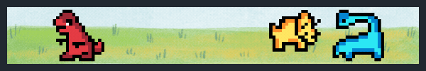

  

## 👋 Olá, me chamo Mateus Sarmento!

Formado **Bacharel em Sistemas de Informação**, com meu TCC focado em IA e visão computacional, e atualmente trabalhando como auxiliar e desenvolvedor Delphi, com experiência em **banco de dados Firebird** e **PostgreSQL**, com foco em automação de rotinas e otimização de processos. Trabalho principalmente no desenvolvimento de sistemas corporativos e relatórios utilizando **comandos SQL** **FastReport**, buscando sempre clareza e eficiência nas soluções.

### 🛠️ Tecnologias e ferramentas

### 🌱 Atualmente aprendendo
Aprofundando meus conhecimentos em **integrações REST** e práticas de versionamento com **Git**.

### 📫 Contato
mateusr.sarmento@gmail.com • [LinkedIn](https://linkedin.com/in/mateusrsarmento)
